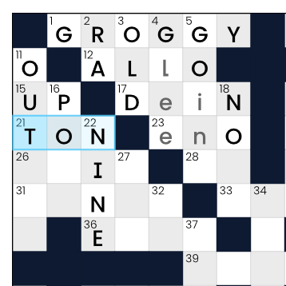

# ~~Poppins~~ Crosslns

## This fork

This repo is a fork of Poppins where the I and L have been modified to disambiguate between the characters. To live up to the license, the output assets have been renamed to 'Crosslns'.

Looks something like this:

During the 1920s, Central European type foundries joined the modernists movements in art and design. Modernism was truly international in scope; only three years after the founding of the German Bauhaus school, several of its painting instructors were already exhibiting their work in Calcutta.

Geometric sans serif typefaces have been a popular design element ever since these actors took to the world’s stage. Poppins is one of the newest comer to this long tradition. An open source family supporting both Devanagari and Latin, this typeface is an internationalist take on the geometric sans genre. Many of the Latin glyphs — the ampersand, for instance — are far more constructed and rationalist than in previously released geometric typefaces. Poppins’s Devanagari design is particularly new. It is likely the first-ever large Devanagari family in this style that has been brought to market.

The Poppins family includes five weights, from Light through Bold. Each font includes 1014 glyphs, including all of the unique conjunct forms necessary for typesetting Indian languages like Hindi, Marathi, Nepali, etc. Just like the Latin glyphs, the Devanagari forms in Poppins are based pure geometry (particularly circles). Poppins’s letters are practically monolinear, although optical corrections have been applied to stroke joints where necessary, to maintain an even colour in text. The Devanagari base character height and the Latin ascender height are equal; Latin capital letters are shorter than the Devanagari characters, and the Latin x-height is set rather high.

The Devanagari glyphs in Poppins were designed by Ninad Kale. The Latin is from Jonny Pinhorn. The Indian Type Foundry first published Poppins in 2014.

